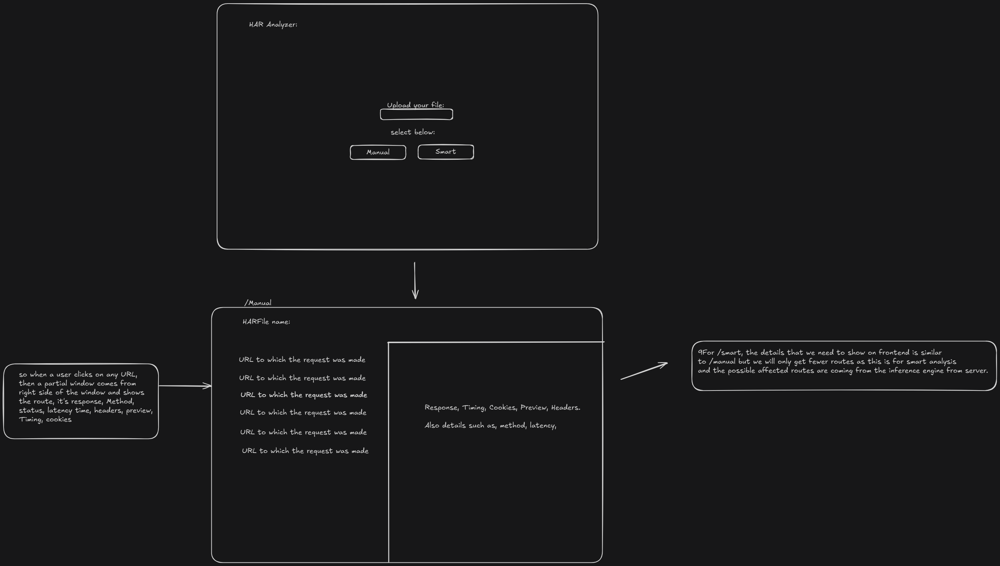

* Will make this file more readable at the end of the project, till then documenting the journey while developing and deploying the project *

new features:

we are targeting something that should be able to give the affected routes but also we should also get the data such as method, url, status, time, request time, content type, size, encoding, priority, protocol, connection, initiator, request index, error for the smart routes -> /smart

for /manual -> I want that all the data present in the HAR file should be shown in a presentable manner on the UI as we have so much data present in request and response with each route/API.

currently checking and identifying new methods and ways to implement above.

the frontend should be similar to below, also there are few details for server as well. there a typical working is below:

